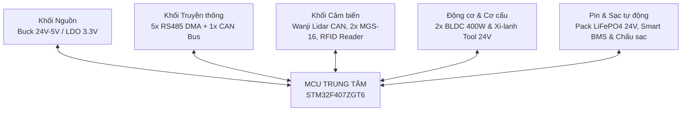
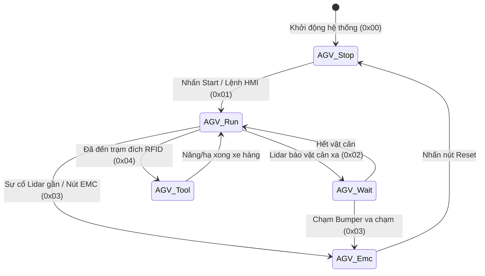
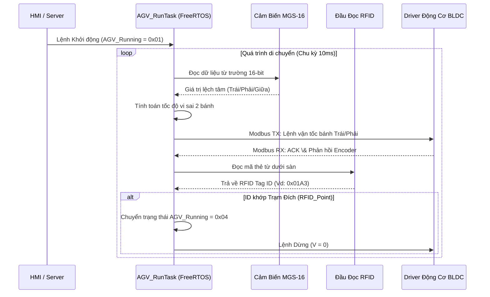
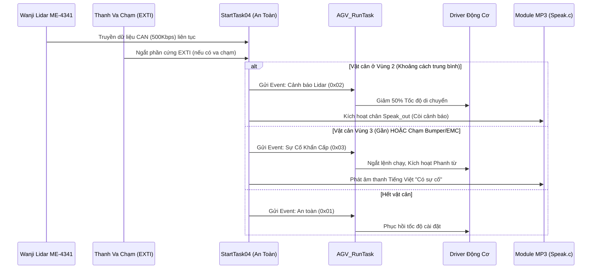
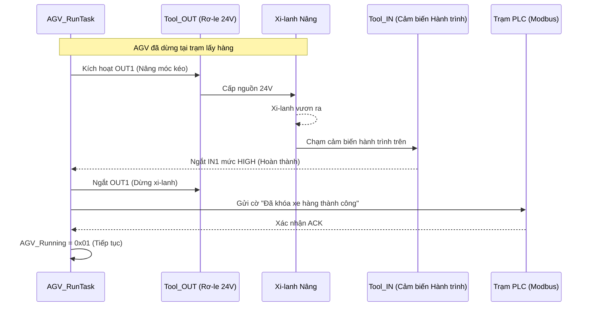
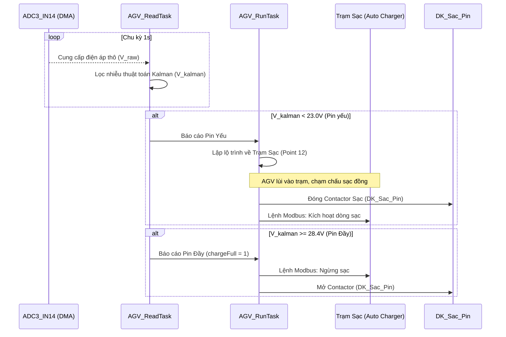
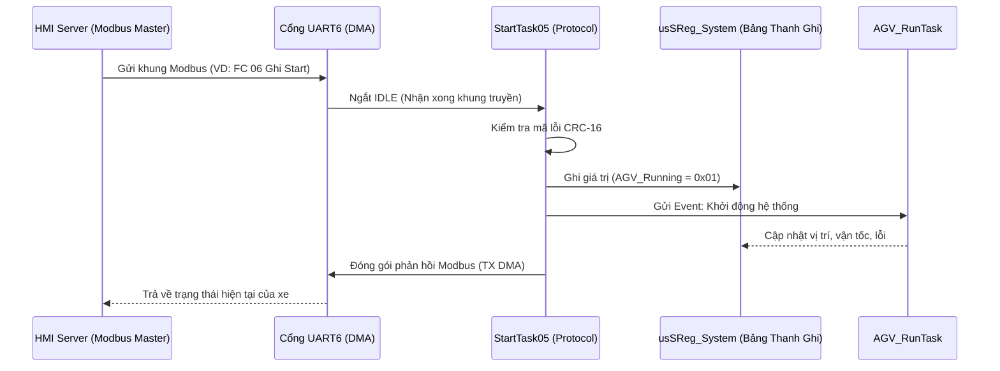

# AGV B400 - Automated Guided Vehicle System 🤖🔋


Hệ thống điều khiển xe tự hành công nghiệp **AGV B400** (Automated Guided Vehicle) dựa trên nền tảng vi điều khiển **STM32F407ZGT6** và hệ điều hành thời gian thực **FreeRTOS**. Hệ thống phục vụ vận chuyển nguyên vật liệu tự động trong nhà máy thông minh (Smart Factory) với thuật toán bám dải từ **MGS-16**, định vị trạm dừng **RFID**, cảm biến laser **Lidar 2D** an toàn đa tầng và chu trình **tự động sạc pin thông minh**.

---

## 📌 Tính Năng Nổi Bật (Key Features)

- ⚡ **Kiến trúc thời gian thực (Real-time determinism):** Chạy đa nhiệm trên **FreeRTOS** với 5 Task chính và ngắt phần cứng 1ms (`TIM9 IRQ`).
- 🚌 **Đa kênh truyền thông công nghiệp (5x RS485 + 1x CAN):**
  - **`Control_Port` (`huart3` DMA Master):** Gửi lệnh vận tốc vi sai 2 bánh lái tới Driver động cơ BLDC 400W.
  - **`System_Port` (`huart6` DMA Slave ID 1):** Giao tiếp giám sát tập trung với Server / HMI.
  - **`PLC_Port` (`huart4` DMA Slave ID 3):** Truyền thông với PLC trạm băng tải sản xuất.
  - **`Charge_Port` (`huart1` DMA Slave ID 27):** Kết nối điều khiển Trạm sạc tự động.
  - **`Battery_Port` (`huart5` DMA Master):** Giám sát trạng thái khối Pin Lithium qua Smart BMS.
  - **1x CAN Bus (500Kbps):** Nhận dữ liệu quét vật cản từ Cảm biến Laser Lidar 2D Wanji ME-4341.
- 🎯 **Dẫn đường \& Định vị trạm dừng:** Thuật toán bám dải đường từ tính (**MGS-16**) kết hợp tra cứu ma trận tọa độ thẻ từ **RFID** (`RFID_Point[13][4]`).
- 🛡️ **Hệ thống an toàn đa tầng 24/7:** Giám sát 3 vùng quét Lidar an toàn (`Smart_channel`), 2 thanh va chạm cơ học ngắt cứng **EXTI15_10** và Nút dừng khẩn cấp **EMC**.
- 🔊 **Báo hiệu tiếng nói Tiếng Việt:** Module MP3 Trigger **Speak.c** kết hợp Loa công nghiệp $4\Omega$ 5W phát thông báo âm thanh cảnh báo.
- 🔋 **Tự động đo Pin \& Cập trạm sạc:** Ứng dụng **Bộ lọc Kalman** tuyến tính lọc nhiễu sụt áp đo từ `ADC3_IN14`, tự động điều khiển xe di chuyển về chấu sạc đồng tiếp xúc tự động (`DK_Sac_Pin`).
- 🏗️ **Cơ cấu nâng/móc hàng tự động (Tool):** Điều khiển xi-lanh điện 24V kéo/nhả xe hàng (Trolley) với phản hồi cảm biến tiệm cận hành trình `Tool_IN1/IN2`.

---

## 📐 Kiến Trúc Hệ Thống (System Architecture)

### 1. Sơ đồ khối phần cứng (Hardware Block Diagram)



---

### 2. Cấu trúc Đa nhiệm FreeRTOS (Task Priority Table)

| Tên Task | Mức Ưu tiên | Hàm xử lý chính | Vai trò \& Chức năng |
| :--- | :---: | :--- | :--- |
| **`AGV_RunTask`** | Normal | `AGV_Control()` | Dẫn đường từ (MGS), xử lý thẻ RFID, tính toán tốc độ vi sai 2 bánh lái. |
| **`AGV_ReadTask`** | Normal | `Charge_Check()` | Đo điện áp Pin qua ADC3 + Bộ lọc Kalman, điều khiển tự động cập trạm sạc. |
| **`StartTask03`** | Normal | `Read_Control()` | Modbus RTU Master điều khiển \& đọc phản hồi từ Driver Động cơ di chuyển. |
| **`StartTask04`** | Normal | `EMC_Control()` | Giám sát an toàn Lidar CAN, Bumper ngắt cứng, nút EMC \& phát âm thanh Speak.c. |
| **`StartTask05`** | Normal | `System_Protocol()` | Giao tiếp Modbus RTU với Server/HMI tập trung và PLC trạm sản xuất. |
| **`TIM9 IRQ`** | Hardware | `HAL_TIM_PeriodElapsed` | Đếm thời gian thực 1ms, xử lý timeout truyền thông \& chống dội nút nhấn. |

---

### 3. Máy Trạng Thái Di Chuyển Toàn Cục (`AGV_Running`)



---

### 4. Sơ Đồ Tuần Tự Hoạt Động (Sequence Diagrams)

#### 4.1. Dẫn đường từ tính \& Nhận dạng Trạm dừng RFID


#### 4.2. Hệ thống An toàn Lidar 2D \& Dừng Khẩn Cấp (EMC)


#### 4.3. Cơ cấu Nâng/Hạ Móc Kéo (Tool Mechanism)


#### 4.4. Đo Điện áp Pin Kalman \& Tự Động Sạc


#### 4.5. Truyền thông Modbus HMI \& PLC


---

## 🗂️ Cấu Trúc Thư Mục Dự Án (Directory Structure)

```
AGV B400 Project/
├── Core/                      # Mã nguồn C/C++ chính (Src/, Inc/)
│   ├── Src/
│   │   ├── main.c             # Khởi tạo CubeMX & kích hoạt FreeRTOS
│   │   ├── stm32f4xx_it.c     # Trình xử lý ngắt cứng phần cứng
│   │   └── freertos.c         # Cấu hình khởi tạo các Task FreeRTOS
│   └── Inc/                   # File header hệ thống
├── User/                      # Thư viện chương trình nhúng ứng dụng AGV
│   ├── ESA_Control.c / .h     # Thuật toán điều khiển di chuyển & Máy trạng thái AGV_Running
│   ├── Speak.c / .h           # Điều khiển module âm thanh cảnh báo MP3 Speak.c
│   └── Kalman.c / .h          # Thuật toán bộ lọc Kalman lọc nhiễu điện áp ADC3
├── Drivers/                   # Thư viện CMSIS & STM32F4xx HAL Driver
├── Middlewares/               # Mã nguồn Hệ điều hành FreeRTOS Kernel
├── MDK-ARM/                   # File Project nạp & biên dịch Keil uVision 5 (`AGV_B400.uvprojx`)
├── Report_AGV_B400/           # Mã nguồn Báo cáo Kỹ thuật bằng LaTeX
│   ├── AGV_B400_Technical_Report.tex  # File LaTeX báo cáo chính (33 trang)
│   ├── AGV_B400_Technical_Report.pdf  # File PDF Báo cáo Kỹ thuật đã biên dịch
│   ├── bia.tex                        # Trang bìa báo cáo chuẩn ĐH Bách Khoa Hà Nội
│   └── Abbreviations.tex              # Danh mục chữ viết tắt
├── AGV_B400.ioc               # File cấu hình chân STM32CubeMX
└── README.md                  # File tài liệu hướng dẫn dự án
```

---

## 🛠️ Danh Mục Linh Kiện Phần Cứng (Hardware Components)

| Khối Chức Năng | Thiết bị / Module | Thông Số Kỹ Thuật \& Vai Trò |
| :--- | :--- | :--- |
| **MCU Trung Tâm** | STM32F407ZGT6 | ARM Cortex-M4 168MHz, 1MB Flash, 192KB SRAM, LQFP-144. |
| **Cảm Biến Lidar 2D** | Wanji ME-4341 | Cảm biến quét Laser an toàn góc $270^\circ$, giao tiếp CAN Bus 500Kbps. |
| **Cảm Biến Đường Từ** | 2x MGS-16 | Mảng 16 phần tử Hall dò dải băng từ dán sàn (Trước \& Sau xe). |
| **Định Vị RFID** | RFID Reader RS485 | Đọc mã thẻ từ thụ động dán sàn định vị vị trí trạm dừng. |
| **Driver Động Cơ** | Dual BLDC Controller | Bộ điều khiển 2 động cơ di chuyển vi sai qua cổng Modbus Master. |
| **Động Cơ Di Chuyển** | 2x BLDC 24V 400W | Động cơ di chuyển chính tích hợp Encoder \& Hộp số vi sai 1:20. |
| **Cơ Cấu Nâng Hàng** | Xi-lanh Điện 24V | Nâng/hạ móc kéo xe hàng Trolley, cảm biến hành trình `Tool_IN`. |
| **Khối An Toàn** | Nút EMC, Bumper | Nút ngắt khẩn 22mm \& thanh va chạm cơ học ngắt cứng EXTI15_10. |
| **Báo Hiệu Âm Thanh** | MP3 Trigger + Loa $4\Omega$ 5W | Phát tiếng nói thông báo Tiếng Việt qua 5 ngõ vào `Speak1`..`Speak5`. |
| **Khối Pin \& Sạc** | Pack Pin LiFePO4 24V | Tích hợp Smart BMS RS485 + Chấu đồng sạc tự động (`DK_Sac_Pin`). |
| **Nguồn Bo Mạch** | LM2596 + AMS1117-3.3V | Buck hạ áp 24V $\rightarrow$ 5V/3A và LDO hạ áp 3.3V cấp nguồn vi điều khiển. |

---

## 💻 Hướng Dẫn Biên Dịch \& Nạp Code (Build & Flash)

### 1. Biên dịch Firmware bằng Keil uVision 5
1. Mở file project: `MDK-ARM/AGV_B400.uvprojx` trong **Keil uVision 5**.
2. Chọn target `AGV_B400` và nhấn **Rebuild** (`F7`).
3. Kết nối bộ nạp **ST-Link V2** với cổng SWD trên bo mạch (`SWCLK`, `SWDIO`, `GND`, `3.3V`).
4. Nhấn **Download** (`F8`) để nạp chương trình vào chip STM32F407ZGT6.

### 2. Biên dịch Báo cáo Kỹ thuật LaTeX
Yêu cầu hệ thống đã cài đặt **MiKTeX** hoặc **TeX Live**:
```bash
cd Report_AGV_B400
pdflatex -interaction=nonstopmode AGV_B400_Technical_Report.tex
pdflatex -interaction=nonstopmode AGV_B400_Technical_Report.tex
```
File PDF đầu ra sẽ được tạo tại: `Report_AGV_B400/AGV_B400_Technical_Report.pdf`.

---

## 👨‍💻 Tác Giả \& Người Thực Hiện

- **Sinh viên thực hiện:** Hồ Quang Quân - MSSV: `20241848E`
- **Giảng viên hướng dẫn:** TS. Nguyễn Hoàng Dũng
- **Đơn vị:** Trường Điện - Điện tử, Trường Đại học Bách Khoa Hà Nội (HUST)

---

## 📜 Giấy Phép (License)

Dự án thuộc bản quyền nghiên cứu của tác giả và Trường Đại học Bách Khoa Hà Nội. Vui lòng ghi rõ nguồn khi tham khảo hoặc tái sử dụng tài nguyên.
